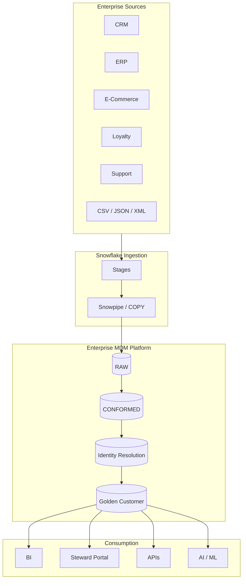

# Enterprise Master Data Management (MDM) Platform Architecture

> Version: 1.0  
> Author: Dinesh Ahire  
> Platform: Snowflake Native  
> Last Updated: July 2026

---

# Table of Contents

1. Introduction
2. Business Problem
3. Solution Overview
4. Architecture Principles
5. High-Level Architecture
6. Platform Components
7. Processing Flow
8. Snowflake Native Services
9. Metadata-Driven Architecture
10. Security & Governance
11. Scalability & Performance
12. High Availability & Reliability
13. Architecture Decisions
14. Future Roadmap

---

# 1. Introduction

## Purpose

The Enterprise Master Data Management (MDM) Platform provides a centralized, trusted, and governed view of customer data by consolidating records from multiple enterprise systems into a single Golden Customer record.

The platform leverages Snowflake-native capabilities including Snowpipe, Streams, Tasks, Snowpark Python, and Streamlit to build a scalable, metadata-driven, and cloud-native MDM solution.

Rather than relying on tightly coupled ETL pipelines, the platform emphasizes modularity, configuration-driven processing, and enterprise governance.

---

# 2. Business Problem

Large organizations often maintain customer information across multiple business applications.

Examples include:

- CRM
- ERP
- E-Commerce
- Loyalty Programs
- Customer Support
- Marketing Platforms

Each system owns only part of the customer's profile.

As a result:

- Duplicate customer records exist.
- Customer attributes become inconsistent.
- Data quality varies across systems.
- Business reports produce conflicting results.
- Customer experiences become fragmented.

Without a centralized master record, organizations struggle to answer a simple question:

> **Who is our customer?**

---

# 3. Solution Overview

The MDM platform ingests customer data from multiple source systems and processes it through a series of standardized stages.

Core processing includes:

- Data ingestion
- Data standardization
- Data quality validation
- Identity resolution
- Survivorship
- Golden Record creation

The final output is a trusted customer master that can be consumed by downstream applications, reporting systems, and AI workloads.

---

# 4. Architecture Principles

The platform is designed around the following principles.

## Snowflake Native

The solution exclusively uses Snowflake-native capabilities wherever possible.

Examples include:

- Internal & External Stages
- Snowpipe
- Streams
- Tasks
- Snowpark Python
- Stored Procedures

---

## Metadata Driven

Business rules are externalized into configuration tables.

Examples include:

- Matching thresholds
- Standardization rules
- Survivorship logic
- Source priorities
- Data quality rules

This enables new source systems to be onboarded with minimal code changes.

---

## Modular

Each processing stage is implemented as an independent engine.

Examples include:

- Ingestion Engine
- Standardization Engine
- Data Quality Engine
- Matching Engine
- Survivorship Engine

This improves maintainability and testability.

---

## Incremental Processing

Rather than performing full refreshes, the platform processes only changed records using Snowflake Streams.

Benefits include:

- Lower compute costs
- Faster execution
- Better scalability

---

## Explainable Processing

Every important decision is auditable.

Examples include:

- Why two customers matched
- Why an attribute was selected
- Which survivorship rule was applied

---

# 5. High-Level Architecture

The platform follows a layered architecture that separates ingestion, processing, governance, and consumption concerns.

---

# 6. Platform Components

## Source Systems

The platform supports structured and semi-structured data from multiple enterprise systems.

Supported formats include:

- CSV
- JSON
- XML
- Parquet
- Avro

---

## Ingestion Layer

Responsible for securely loading source data into Snowflake.

Components:

- Internal Stages
- External Stages
- Snowpipe
- COPY INTO
- Snowpark Ingestion Engine

---

## Bronze Layer

Stores raw customer records exactly as received.

Characteristics:

- Immutable
- Source-specific
- Audit-friendly

---

## Silver Layer

Produces standardized and validated customer records.

Processing includes:

- Standardization
- Data Quality
- Reference validation
- Business rule validation

---

## Identity Resolution Layer

Identifies duplicate customers using configurable matching algorithms.

Capabilities:

- Blocking
- Candidate generation
- Similarity scoring
- Manual review

---

## Gold Layer

Produces the authoritative Golden Customer record.

Includes:

- Golden Customer
- History
- Cross Reference
- Survivorship Audit

---

## Serving Layer

Provides trusted master data to downstream consumers.

Examples:

- BI Dashboards
- Data APIs
- AI Applications
- Streamlit Steward Portal

---

# 7. Processing Flow

The platform executes the following logical workflow:

1. Ingest source data.
2. Store raw records.
3. Standardize customer attributes.
4. Validate data quality.
5. Identify duplicate customers.
6. Apply survivorship rules.
7. Publish Golden Customer records.
8. Record lineage and audit information.

The workflow is fully incremental using Snowflake Streams and orchestrated through Tasks.

---

# 8. Snowflake Native Services

The platform relies on several Snowflake-native capabilities.

| Service | Purpose |
|----------|---------|
| Internal Stage | Landing zone for internal files |
| External Stage | Cloud storage integration |
| Snowpipe | Automated file ingestion |
| Streams | Incremental change tracking |
| Tasks | Workflow orchestration |
| Snowpark Python | Business processing |
| Stored Procedures | Pipeline execution |

---

# 9. Metadata-Driven Architecture

One of the primary design goals is eliminating hardcoded business logic.

All processing behavior is controlled through metadata.

Examples include:

- Source onboarding
- Matching thresholds
- Standardization rules
- DQ rules
- Survivorship rules

This design significantly reduces future development effort and simplifies maintenance.

---

# 10. Security & Governance

The platform incorporates enterprise governance features.

Examples include:

- Role-Based Access Control (RBAC)
- Data lineage
- Pipeline audit logs
- Cross-reference tracking
- Historical versioning
- Data stewardship

Sensitive data access is controlled through Snowflake roles.

---

# 11. Scalability & Performance

The platform is designed to scale horizontally through Snowflake's elastic compute model.

Performance optimizations include:

- Incremental processing
- Parallel Tasks
- Stream-based execution
- Metadata-driven pipelines
- Modular processing engines

---

# 12. High Availability & Reliability

The architecture minimizes operational risk through:

- Immutable raw storage
- Pipeline restartability
- Incremental replay
- Audit logging
- Failure isolation
- Manual review workflows

These capabilities improve operational resilience and support enterprise-grade reliability.

---

# 13. Architecture Decisions

| Decision | Rationale |
|----------|-----------|
| Snowflake Native | Minimize external dependencies |
| Metadata-driven rules | Increase flexibility |
| Streams over full refresh | Reduce compute cost |
| Modular engines | Improve maintainability |
| Snowpark Python | Reusable business logic |
| Streamlit | Native stewardship experience |

---

# 14. Future Roadmap

Potential future enhancements include:

- Machine learning–based entity resolution
- Snowpipe Streaming
- Event-driven notifications
- REST APIs
- Data Catalog integration
- GenAI-assisted stewardship
- Multi-domain MDM (Product, Supplier, Location)

---

# Conclusion

The Enterprise MDM Platform provides a scalable, metadata-driven, Snowflake-native solution for mastering customer data across heterogeneous enterprise systems.

By combining modular processing engines, incremental execution, governance, and explainable matching, the platform establishes a trusted foundation for analytics, operational systems, and AI-powered applications.