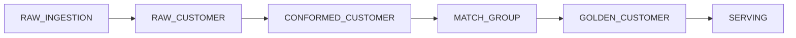

# Data Model

> Version: 1.0  
> Author: Dinesh Ahire  
> Platform: Snowflake Native  
> Last Updated: July 2026

---

# Table of Contents

1. Purpose
2. Data Lifecycle
3. Database Organization
4. Schema Design
5. Core Data Model
6. Configuration Model
7. Metadata Model
8. Reference Data Model
9. Processing Flow
10. Table Summary
11. Data Retention Strategy

---

# 1. Purpose

This document describes the logical and physical data model used by the Enterprise Master Data Management (MDM) Platform.

The data model is designed to support:

- Metadata-driven processing
- Incremental data ingestion
- Identity resolution
- Golden Record management
- Enterprise governance
- Auditability
- Operational monitoring

The model follows a layered architecture that separates raw ingestion, standardized data, mastered data, metadata, and configuration.

---

# 2. Data Lifecycle

```text
Enterprise Sources

↓

RAW

↓

CONFORMED

↓

MATCH_GROUP

↓

GOLDEN_CUSTOMER

↓

SERVING
```

Each layer has a clearly defined responsibility and ownership.

---

# 3. Database Organization

The platform is organized into dedicated schemas.

| Schema | Purpose |
|----------|---------|
| CONFIG | Metadata-driven configuration |
| REFERENCE | Lookup and reference data |
| RAW | Raw source data |
| CONFORMED | Standardized customer data |
| GOLDEN | Master customer records |
| METADATA | Pipeline execution metadata |
| AUDIT | Audit and lineage |
| SERVING | Reporting and downstream consumption |

This separation improves maintainability, governance, and security.

---

# 4. Schema Design

```text
MDM_DATABASE

│

├── CONFIG

├── REFERENCE

├── RAW

├── CONFORMED

├── GOLDEN

├── METADATA

├── AUDIT

└── SERVING
```

Each schema owns a specific responsibility and minimizes cross-layer dependencies.

---

# 5. Core Data Model

## RAW Schema

The RAW schema stores source data exactly as received.

### RAW_INGESTION

Purpose

Landing table for semi-structured source data.

Characteristics

- VARIANT payload
- Immutable
- Source metadata
- File metadata

---

### RAW_CUSTOMER

Purpose

Normalized raw customer records after ingestion.

Characteristics

- One row per customer
- Source-specific identifiers
- Minimal transformations

---

### RAW_CHANGE_LOG

Purpose

Tracks changes received from source systems.

---

## CONFORMED Schema

The CONFORMED schema stores standardized customer data.

### CONFORMED_CUSTOMER

Purpose

Stores validated customer records ready for identity resolution.

Includes

- Standardized names
- Normalized addresses
- Standardized phone numbers
- Clean email addresses

---

### DQ_RESULTS

Purpose

Stores results of data quality validation.

Includes

- Rule executed
- Status
- Score
- Failure reason

---

### REJECTED_RECORDS

Purpose

Stores records that fail mandatory validation.

---

## GOLDEN Schema

Contains mastered customer data.

### GOLDEN_CUSTOMER

Purpose

Authoritative customer record.

Characteristics

- One customer
- One Golden ID
- Enterprise trusted

---

### GOLDEN_HISTORY

Purpose

Maintains historical versions of Golden Records.

Supports

- Auditing
- Rollback
- Time travel

---

### XREF

Purpose

Maps source customer IDs to Golden Customer IDs.

Example

| Source | Customer ID | Golden ID |
|----------|------------|-----------|
| CRM | 1001 | G0001 |
| ERP | C882 | G0001 |
| ECOM | E551 | G0001 |

---

### SURVIVORSHIP_AUDIT

Purpose

Captures why each Golden attribute was selected.

Example

| Attribute | Winning Source | Rule |
|------------|---------------|------|
| Email | CRM | Highest Confidence |
| Phone | ERP | Most Recent |

---

# 6. Configuration Model

Business logic is externalized into metadata tables.

| Table | Purpose |
|---------|----------|
| CONFIG_SOURCE_SYSTEMS | Registered source systems |
| CONFIG_STANDARDIZATION_RULES | Standardization logic |
| CONFIG_DQ_RULES | Data Quality rules |
| CONFIG_MATCH_RULES | Matching configuration |
| CONFIG_SURVIVORSHIP_RULES | Survivorship configuration |
| CONFIG_PIPELINE | Pipeline settings |

This design minimizes code changes when onboarding new sources or updating business rules.

---

# 7. Metadata Model

Operational metadata is captured separately from business data.

## PIPELINE_RUN

Stores execution details.

Examples

- Start Time
- End Time
- Status
- Duration
- Rows Processed

---

## FILE_LOAD_HISTORY

Tracks every processed file.

Includes

- File Name
- Source System
- Load Timestamp
- Status

---

## OBJECT_LINEAGE

Stores lineage information.

Supports

- Traceability
- Compliance
- Root Cause Analysis

---

## ERROR_LOG

Captures execution failures.

---

## RECONCILIATION_METRICS

Stores source-to-target reconciliation statistics.

---

# 8. Reference Data Model

Reference tables provide standardized lookup values.

Examples include:

- REF_COUNTRY
- REF_STATE
- REF_GENDER
- REF_CUSTOMER_STATUS
- REF_PHONE_COUNTRY_CODE

Reference data is shared across all processing engines.

---

# 9. Processing Flow



Each stage enriches the data while preserving traceability to the original source.

---

# 10. Table Summary

## CONFIG Schema

| Table |
|---------|
| CONFIG_SOURCE_SYSTEMS |
| CONFIG_PIPELINE |
| CONFIG_STANDARDIZATION_RULES |
| CONFIG_DQ_RULES |
| CONFIG_MATCH_RULES |
| CONFIG_SURVIVORSHIP_RULES |

---

## RAW Schema

| Table |
|---------|
| RAW_INGESTION |
| RAW_CUSTOMER |
| RAW_CHANGE_LOG |

---

## CONFORMED Schema

| Table |
|---------|
| CONFORMED_CUSTOMER |
| DQ_RESULTS |
| REJECTED_RECORDS |

---

## GOLDEN Schema

| Table |
|---------|
| GOLDEN_CUSTOMER |
| GOLDEN_HISTORY |
| XREF |
| SURVIVORSHIP_AUDIT |

---

## METADATA Schema

| Table |
|---------|
| PIPELINE_RUN |
| FILE_LOAD_HISTORY |
| OBJECT_LINEAGE |
| ERROR_LOG |
| RECONCILIATION_METRICS |

---

## REFERENCE Schema

| Table |
|---------|
| REF_COUNTRY |
| REF_STATE |
| REF_GENDER |
| REF_CUSTOMER_STATUS |
| REF_PHONE_COUNTRY_CODE |

---

# 11. Data Retention Strategy

| Layer | Retention |
|----------|-----------|
| RAW | Long-term (Immutable) |
| CONFORMED | Current + Reprocessing Window |
| GOLDEN | Active + Historical Versions |
| METADATA | Configurable |
| AUDIT | Long-term |
| REFERENCE | Permanent |

The retention strategy ensures complete traceability while supporting historical analysis and regulatory compliance.

---

# Conclusion

The Enterprise MDM data model is organized into dedicated schemas that separate configuration, processing, governance, and mastered data. This layered approach promotes scalability, maintainability, and auditability while enabling metadata-driven processing and enterprise-grade Master Data Management.