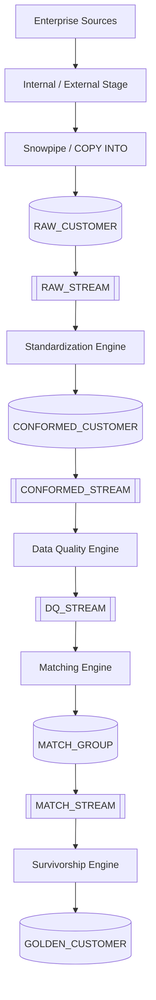
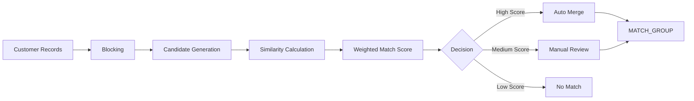

# Technical Design Document

> Version: 1.0  
> Author: Dinesh Ahire  
> Platform: Snowflake Native  
> Last Updated: July 2026

---

# Table of Contents

1. Purpose
2. Design Goals
3. End-to-End Processing Flow
4. Layered Architecture
5. Processing Engines
6. Snowpark Framework
7. Metadata-Driven Configuration
8. Incremental Processing
9. Identity Resolution Design
10. Survivorship Design
11. Pipeline Orchestration
12. Logging & Observability
13. Error Handling & Recovery
14. Performance Considerations

---

# 1. Purpose

This document describes the internal technical design of the Enterprise Master Data Management (MDM) Platform.

While the Architecture document explains **what** the platform is, this document explains **how** it is implemented.

The design focuses on modularity, maintainability, extensibility, and the use of Snowflake-native capabilities.

---

# 2. Design Goals

The platform is designed with the following engineering objectives:

- Modular processing engines
- Metadata-driven execution
- Incremental data processing
- Loose coupling between components
- Explainable matching decisions
- High observability
- Enterprise scalability
- Simplified operational support

---

# 3. End-to-End Processing Flow



The platform follows an incremental event-driven pipeline where each processing stage consumes changes from a Snowflake Stream and produces output for the next stage.

---

# 4. Layered Architecture

The platform is organized into logical processing layers.

## Ingestion Layer

Responsibilities:

- Receive source files
- Validate file structure
- Load raw records
- Capture ingestion metadata

Output:

- RAW_CUSTOMER

---

## Bronze Layer

Stores immutable copies of source records.

Characteristics:

- Source-specific
- Minimal transformations
- Full auditability

---

## Silver Layer

Standardizes and validates customer data.

Processing includes:

- Name normalization
- Address normalization
- Phone formatting
- Email validation
- Reference data validation
- Business rule validation

Output:

- CONFORMED_CUSTOMER

---

## Identity Resolution Layer

Detects duplicate customer records using configurable matching algorithms.

Major activities:

- Blocking
- Candidate generation
- Similarity calculation
- Match scoring
- Manual review

Output:

- MATCH_GROUP

---

## Gold Layer

Creates the authoritative Golden Customer record.

Artifacts include:

- GOLDEN_CUSTOMER
- XREF
- HISTORY
- SURVIVORSHIP_AUDIT

---

# 5. Processing Engines

Each processing stage is implemented as an independent engine.

## Ingestion Engine

Responsibilities:

- Discover source files
- Validate files
- Execute COPY INTO
- Archive processed files
- Quarantine invalid files

---

## Standardization Engine

Responsibilities:

- Normalize names
- Standardize phone numbers
- Standardize email addresses
- Validate addresses
- Apply configurable transformations

---

## Data Quality Engine

Responsibilities:

- Completeness validation
- Validity checks
- Reference validation
- Business rule validation
- DQ score calculation

---

## Matching Engine

Responsibilities:

- Blocking
- Candidate generation
- Similarity scoring
- Match decision
- Manual review routing

---

## Survivorship Engine

Responsibilities:

- Resolve conflicting attributes
- Apply survivorship rules
- Generate Golden Records
- Update XREF
- Maintain history

---

# 6. Snowpark Framework

Business logic is implemented using reusable Snowpark Python components.

```
snowpark/

framework/

    base_procedure.py
    logger.py
    config_loader.py
    metadata_manager.py
    validator.py
    pipeline_context.py
```

## Base Procedure

Every processing engine extends a common base class.

Responsibilities:

- Initialize Snowpark Session
- Load configuration
- Validate inputs
- Execute processing
- Capture metrics
- Log execution
- Handle exceptions

This ensures a consistent execution pattern across all engines.

---

# 7. Metadata-Driven Configuration

Business rules are stored in configuration tables rather than embedded in code.

Examples include:

- Source priorities
- Matching thresholds
- Data quality rules
- Standardization rules
- Survivorship rules

Advantages:

- No code changes for rule updates
- Faster onboarding
- Improved maintainability
- Business-user configurability

---

# 8. Incremental Processing

The platform processes only changed records using Snowflake Streams.

Processing sequence:

```
RAW_STREAM
      ↓
Standardization

↓

CONFORMED_STREAM

↓

Data Quality

↓

DQ_STREAM

↓

Matching

↓

MATCH_STREAM

↓

Survivorship
```

Benefits:

- Lower compute consumption
- Reduced execution time
- Improved scalability

---

# 9. Identity Resolution Design



Matching combines multiple attributes such as:

- Name
- Email
- Phone
- Address
- Date of Birth

Each attribute contributes to a weighted composite score.

Thresholds are configurable through metadata.

---

# 10. Survivorship Design

After records are grouped, survivorship rules determine the authoritative value for each attribute.

Supported strategies include:

- Source Priority
- Most Recent Value
- Highest Confidence
- Longest Non-null Value
- Custom Rule

Every attribute selection is recorded in the Survivorship Audit table to provide complete explainability.

---

# 11. Pipeline Orchestration

Processing is orchestrated using Snowflake Tasks.

Execution sequence:

```
Task_Ingestion

↓

Task_Standardization

↓

Task_Data_Quality

↓

Task_Matching

↓

Task_Survivorship
```

Each task is triggered only when upstream Streams contain new data.

This minimizes unnecessary warehouse usage.

---

# 12. Logging & Observability

Every execution records operational metadata.

Captured information includes:

- Pipeline Run ID
- Execution timestamps
- Source system
- Records processed
- Success/failure status
- Execution duration
- Error details

Operational metrics are stored in dedicated metadata tables for monitoring and troubleshooting.

---

# 13. Error Handling & Recovery

The platform supports robust failure management.

Strategies include:

- File quarantine
- Transaction rollback
- Retryable processing
- Idempotent execution
- Detailed error logging
- Replay from Streams

This design minimizes operational impact and simplifies recovery.

---

# 14. Performance Considerations

The platform incorporates several performance optimizations:

- Incremental processing with Streams
- Metadata-driven execution
- Modular processing engines
- Parallel task execution
- Elastic warehouse scaling
- Minimized data movement
- Snowflake-native compute

These design choices enable the platform to scale efficiently as data volume and source systems grow.

---

# Conclusion

The technical design emphasizes modularity, metadata-driven execution, and Snowflake-native capabilities to deliver a scalable, maintainable, and enterprise-ready MDM platform.

Each processing engine has a clearly defined responsibility, allowing new capabilities to be introduced with minimal impact on existing components while maintaining operational reliability and governance.